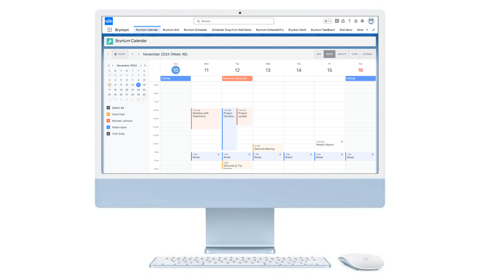
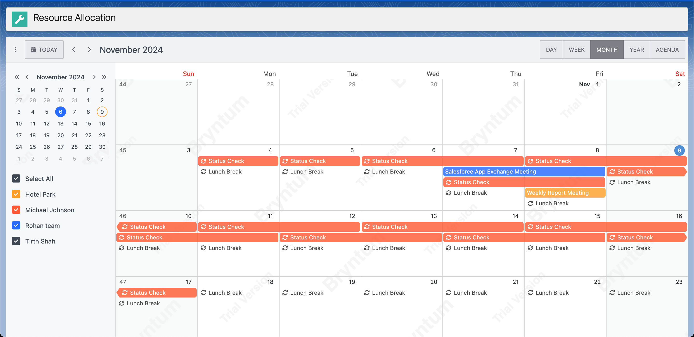

# Bryntum Gantt for Construction Resource Management

### 🏗️ Project Description:
A visual task scheduling and resource planning tool embedded within Salesforce. Built specifically for a construction-sector finance platform.

### 🖼 Screenshot Preview:

### 🧠 Key Features:
- Bryntum Gantt chart integration inside a Salesforce LWC
- Timeline view of construction tasks and assignments
- Drag-and-drop task reordering and dependency management
- Progress tracking and task status color indicators

### 🔧 Tech Used:
- Lightning Web Components (LWC)
- Apex for data storage and updates
- Static resources (Bryntum)
- SLDS for theming

### 🎯 Business Impact:
- Improved task visibility for managers
- Centralized planning and resource allocation
- Real-time updates in Salesforce for field users

