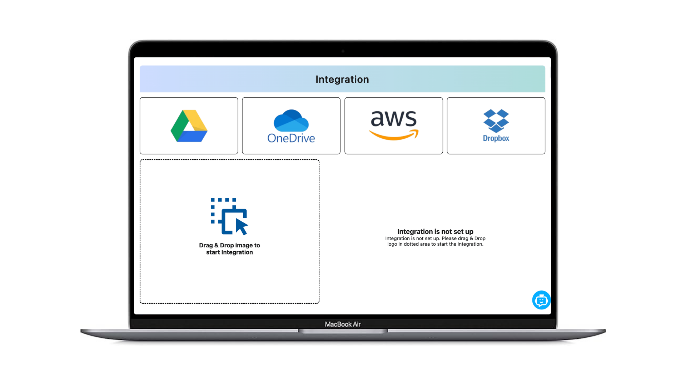
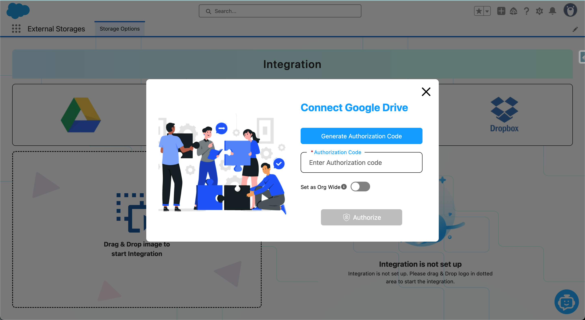
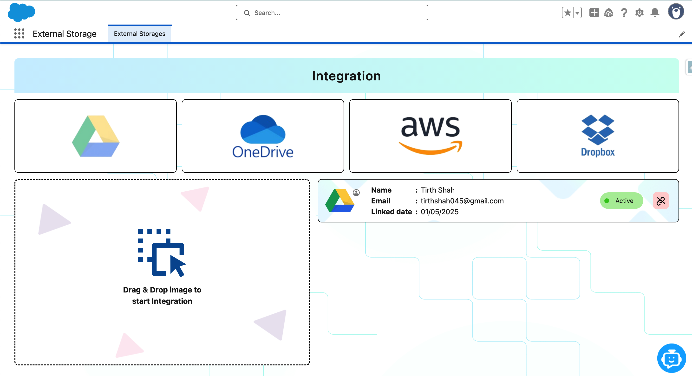

# External Storage Integration in Salesforce

### 🔍 Overview:
This project focused on enabling Salesforce users to upload and manage files via **four major external storage platforms**:
- Google Drive
- OneDrive
- Dropbox
- Amazon S3 (AWS)

The integration allowed dynamic file uploads, downloads, and previews directly from Salesforce UI.

### 🖼 Screenshot Preview:

### 🔧 Technologies Used:
- Apex (HTTP Callouts + Named Credentials)
- Lightning Web Components (LWC)
- OAuth 2.0 Authentication
- Platform Events & Custom Metadata
- REST API for external services

### 🧩 Features:
- Secure OAuth authentication with refresh tokens
- File upload/download from each external service
- Dynamic selection of target storage platform
- Custom file manager UI using SLDS

### 📸 Sample Screenshot:
Add a screenshot of the UI file manager or dropdown.
