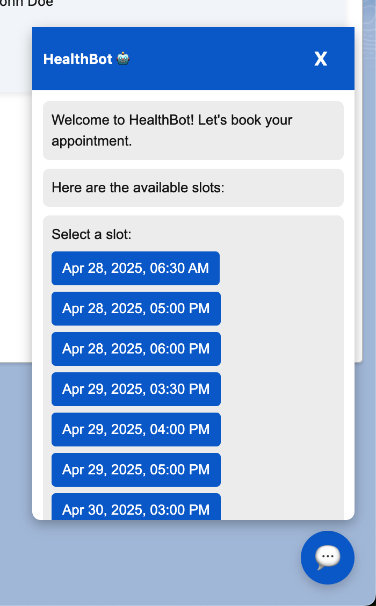
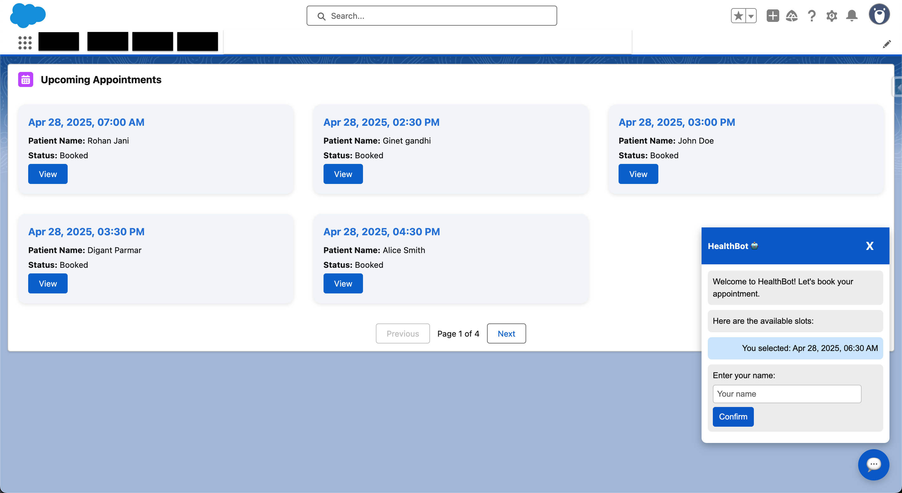

# Health Bot Appointment Scheduler

### 🩺 Description:
Developed a conversational bot interface within Salesforce to allow patients to **book appointments**, **reschedule**, or **cancel** based on availability.

### 🖼 Screenshot Preview:

### 🔧 Tech Used:
- Apex with custom appointment logic
- Flow-based chatbot logic
- Lightning Web Components for form + calendar UI
- Platform Events for async reminders

### ✅ Features:
- Conversational interface for appointment handling
- Calendar selection with slot availability
- Real-time confirmation and SMS/Email notification triggers

### 🚀 Highlights:
- Designed to reduce manual scheduling overhead
- Improved patient experience and operational efficiency
