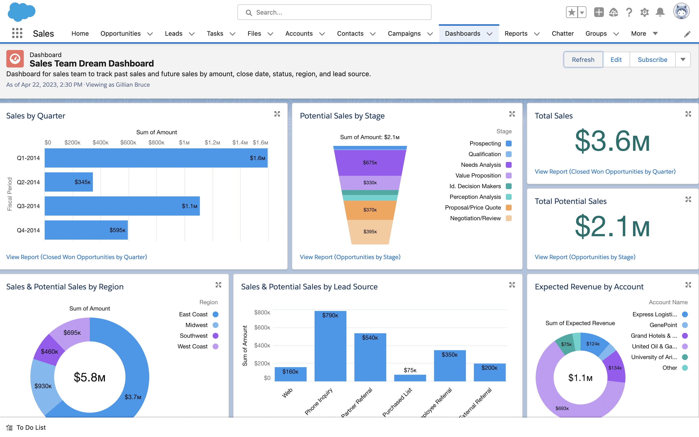

# Custom KPI Dashboard in Salesforce

### 📊 Overview:
Created a real-time **Sales KPI dashboard** for business leaders to monitor performance and metrics inside Salesforce.

### 🖼 Screenshot Preview:

### 📈 Components:
- Revenue trend chart (monthly/quarterly)
- Top-performing regions and reps
- Conversion funnel visualization
- Custom filter components (date range, region)

### 🔧 Tech Stack:
- Apex (data aggregation)
- Lightning Web Components (LWC)
- Chart.js (via static resource)
- SLDS for clean UI

### 📎 Impact:
- Enabled non-technical stakeholders to monitor KPIs
- Empowered decision-makers with actionable data
